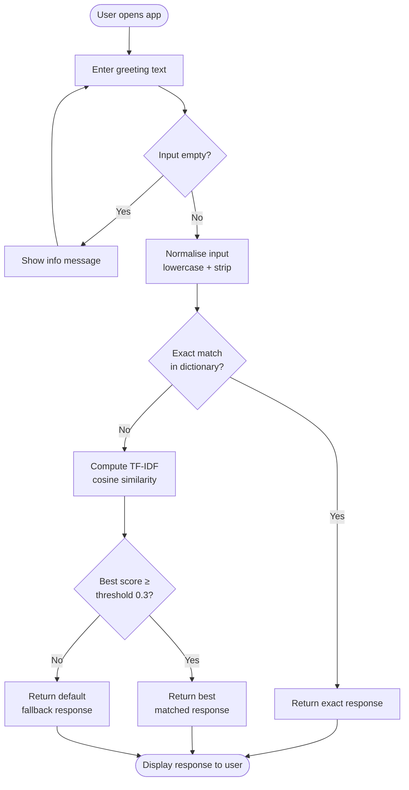
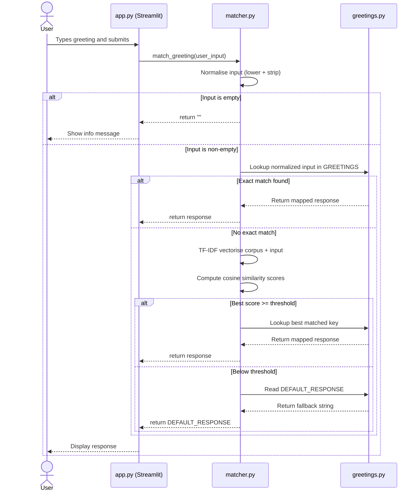

# Greeting Autocomplete — Technical Documentation

## Overview

The Greeting Autocomplete application accepts a free-text greeting from a user and returns an appropriate, pre-defined response. Matching is performed with scikit-learn TF-IDF vectorisation and cosine similarity so that common typos and partial inputs still resolve correctly.

---

## Architecture

### Components

| Component | File | Responsibility |
|-----------|------|----------------|
| UI Layer | `app.py` | Renders Streamlit widgets and calls the matcher |
| Matcher | `matcher.py` | Normalises input, runs TF-IDF similarity, returns response |
| Data | `greetings.py` | Holds the greeting → response dictionary and fallback constant |
| Tests | `test_matcher.py` | pytest unit tests covering data integrity and matcher behaviour |

---

## User Flowchart



---

## Sequence Diagram



---

## Matching Algorithm

### Normalisation

```
normalised = input.lower().strip()
```

### TF-IDF Vectorisation

- **Analyser:** `char_wb` (character n-grams within word boundaries)
- **N-gram range:** (2, 3) — bi-grams and tri-grams
- The corpus consists of all known greeting keys plus the normalised user input appended at the end.

### Cosine Similarity

Cosine similarity is computed between the query vector (last row) and all known greeting vectors.  
The index of the maximum score is used to retrieve the matched greeting key.

### Threshold

| Parameter | Value | Description |
|-----------|-------|-------------|
| `THRESHOLD` | `0.3` | Minimum cosine similarity to accept a fuzzy match |

---

## Test Coverage

| Test Class | Coverage Area |
|------------|--------------|
| `TestDataIntegrity` | Dictionary structure, key/value types, non-empty checks |
| `TestExactMatches` | Known greetings return correct responses |
| `TestCaseInsensitive` | Upper and mixed-case inputs normalise correctly |
| `TestWhitespaceNormalization` | Leading/trailing whitespace stripped |
| `TestFuzzyMatches` | Typos and partial inputs resolve via TF-IDF |
| `TestEdgeCases` | Empty strings, whitespace-only, numeric, and unknown inputs |
